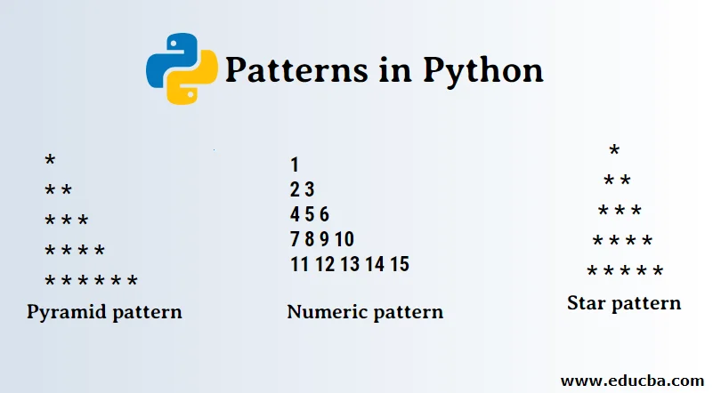

# 🔁 جلسه سوم: حلقه‌ها و تکرار (Loops & Iteration)

## ۱. منطق تکرار در برنامه‌نویسی

- **هدف:** اجرای یک دستور یا بلوکی از کد به صورت متوالی و بدون وقفه.
- **تفاوت با `if`:** در `if` دستور _یک بار_ اجرا می‌شود (اگر شرط درست باشد)؛ در حلقه‌ها، دستور تا زمانی که شرط برقرار است، _بارها و بارها_ تکرار می‌شود.

---

## ۲. حلقه‌ی `while` (تکرار بر اساس شرط)

- **مفهوم اصلی:** نزدیک‌ترین مفهوم به عبارت شرطی که قبلاً یاد گرفتیم. حلقه تا زمانی که **شرط بولی (Boolean Condition)** آن `True` باشد، ادامه پیدا می‌کند.
- **نقطه حیاتی (Exit Condition):** متغیری که در شرط استفاده می‌شود، **حتماً** باید در داخل بدنه حلقه تغییر کند تا در نهایت شرط `False` شده و حلقه پایان یابد. (مفهوم **Infinite Loop** را اینجا توضیح دهید).

<!-- end list -->

```python
# مثال: شمارش از ۱ تا ۳
counter = 1
while counter <= 3:
    print(f"Current count: {counter}")
    counter = counter + 1 # Update the variable!

# Output: Current count: 1, 2, 3
```

### شبیه‌سازی `do-while`

- **نیاز:** اجرای کد حداقل برای **یک بار**، حتی اگر شرط از ابتدا نادرست باشد.
- **شبیه‌سازی در پایتون:** با استفاده از `while True` و دستور `break` (که در ادامه می‌آید).

<!-- end list -->

```python
while True:
    print("This runs at least once.")
    # Here, check your condition and break manually
    break
```

---

## ۳. حلقه‌ی `for` (تکرار با استفاده از `range`)

- **مفهوم اصلی:** حلقه‌ای که برای اجرای یک عملیات به تعداد مشخصی طراحی شده است.
- **تابع `range()`:** این تابع یک **توالی عددی (Sequence of Numbers)** ایجاد می‌کند که حلقه `for` روی آن تکرار می‌شود.
  - **Syntax:**
    - `range(stop)`: (از ۰ تا `stop-1`)
    - `range(start, stop)`: (از `start` تا `stop-1`)
    - `range(start, stop, step)`: (با گام‌های مشخص)

<!-- end list -->

```python
# مثال: تکرار ۵ بار
for i in range(5):
    print(f"Iteration number: {i}")

# Output: Iteration number: 0, 1, 2, 3, 4
```

---

## ۴. مفهوم Index (ایندکس)

- **مفهوم در این جلسه:** در اینجا، منظور از **ایندکس**، همان **متغیر شمارنده‌ای** است که در حلقه `for` توسط تابع `range` ایجاد می‌شود (معمولاً با نام `i`).
- **کاربرد:** از این متغیر برای انجام محاسبات ریاضی یا منطقی در داخل حلقه استفاده می‌کنیم.

<!-- end list -->

```python
# مثال: استفاده از ایندکس برای محاسبه مربع
for i in range(1, 4):
    square = i * i
    print(f"The square of {i} is {square}")
# Output: The square of 1 is 1, The square of 2 is 4, The square of 3 is 9
```

---

## ۵. دستورات کنترل حلقه (`break`, `continue`)

- **هدف:** کنترل مسیر اجرای حلقه از داخل بدنه آن.

### الف) `break` (توقف و خروج کامل)

- **عملکرد:** به محض اجرا، برنامه فوراً از حلقه خارج شده و به اولین دستور بعد از حلقه می‌رود.
- **کاربرد:** زمانی که به نتیجه دلخواه رسیده‌ایم و نیازی به ادامه تکرار نیست.

<!-- end list -->

```python
# مثال: توقف جستجو بعد از رسیدن به عدد ۸
for number in range(1, 15):
    if number == 8:
        print("Target found. Stopping.")
        break
    print(f"Checking: {number}")
```

### ب) `continue` (پرش از تکرار فعلی)

- **عملکرد:** به محض اجرا، بقیه کدهای آن تکرار نادیده گرفته شده و حلقه به سراغ تکرار بعدی می‌رود.
- **کاربرد:** زمانی که یک وضعیت خاص (مثلاً عدد منفی یا صفر) را می‌خواهیم نادیده بگیریم.

<!-- end list -->

```python
# مثال: نادیده گرفتن اعداد بخش پذیر بر ۳
for i in range(1, 7):
    if i % 3 == 0:
        continue # Skip 3 and 6
    print(f"Processing: {i}")
# Output: Processing: 1, 2, 4, 5
```

---

## ۶. حلقه‌های تو در تو (Nested Loops)

- **مفهوم:** قرار دادن یک حلقه (داخلی) درون بدنه یک حلقه دیگر (خارجی).
- **قانون تکرار:** به ازای **هر بار** اجرای حلقه خارجی، حلقه داخلی **یک دور کامل** اجرا می‌شود.
- **کاربرد:** ایجاد ساختارهای جدولی، ساعت‌ها و تقویم‌ها.

<!-- end list -->

```python
# مثال: ساخت یک ساعت ساده (فقط نمایش)
for hour in range(3): # 0, 1, 2
    for minute in range(2): # 0, 1
        print(f"Time: {hour:02}:{minute:02}")
# Total runs: 3 * 2 = 6 times
```

---

## 🚀 سؤالات کاربردی

### ۱. چالش `for` و `range()` (جمع زدن اعداد)

**سؤال:** برنامه‌ای بنویسید که از کاربر یک عدد (`N`) بگیرد، سپس مجموع تمامی اعداد زوج از ۱ تا `N` را محاسبه و در نهایت، مجموع را چاپ کند. (مثلاً اگر `N=10`، مجموع $2+4+6+8+10$ محاسبه شود.)

### ۲. چالش `while` و ورودی‌های نامعتبر

**سؤال:** از کاربر بخواهید یک عدد مثبت را وارد کند. تا زمانی که عدد ورودی منفی یا صفر است، پیام `Error: Please enter a positive number.` را چاپ کرده و دوباره درخواست ورود عدد را تکرار کند. (از شبیه‌سازی `do-while` استفاده کنید.)

### ۳. چالش `break` و جستجوی عدد

**سؤال:** برنامه‌ای بنویسید که اعداد ۱ تا ۱۰۰ را به ترتیب چک کند. به محض اینکه به اولین عددی رسید که بر ۱۱ **و** بر ۷ بخش‌پذیر است، آن عدد را چاپ کرده و **بلافاصله** از حلقه خارج شود.

### ۴. چالش `continue` و محاسبات مالی

**سؤال:** فرض کنید می‌خواهیم حقوق ۵ کارمند را جمع بزنیم. برنامه‌ای بنویسید که ۵ بار حقوق را از ورودی بپرسد. اگر حقوق وارد شده برابر با صفر بود، آن حقوق را در محاسبه مجموع نادیده بگیرد (به تکرار بعدی برود) و در نهایت، مجموع حقوق معتبر را چاپ کند.

### ۵. چالش حلقه‌های تودرتو (جدول ضرب)

**سؤال:** جدول ضرب اعداد ۱ تا ۱۰ را با استفاده از حلقه‌های تودرتو ایجاد و چاپ کنید. هر خروجی را به صورت `X * Y = Result` نمایش دهید.

**خروجی مورد انتظار (برای ۲ سطر اول):**

```text
1 * 1 = 1
1 * 2 = 2
...
1 * 10 = 10
2 * 1 = 2
2 * 2 = 4
...
```

### ۶. الگو ها

<p align="center">
  
</p>
